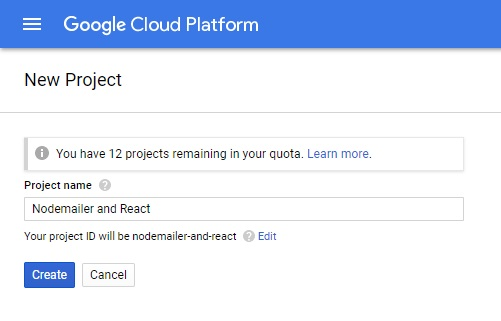
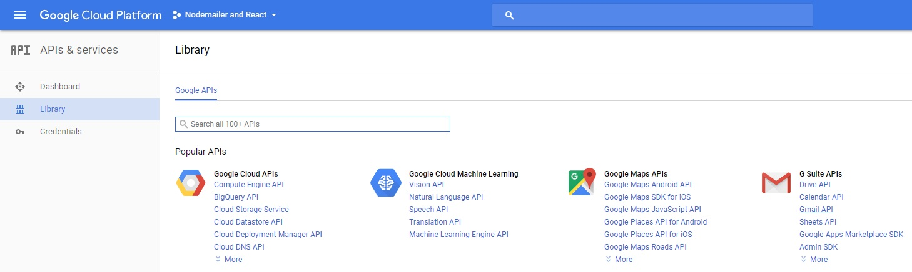
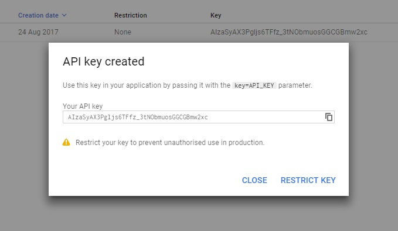

# Creating contact forms with nodemailer and React

Creating a contact form is a very common requested feature, almost every site has one. Creating the HTML form is easy, however there must be some back-end code to transfer those messages. I will show you how to create simple form and wire that up to send contact form submission to your Gmail account.

## Rendering contact form with React

For the sake of clarity there won't be any styling included and the components will be plain old HTML form and input tags. That simple component will do the job:

```javascript
const ContactForm = () => (
  <form method="POST">
    <label htmlFor="name">Name</label>
    <input type="text" name="name" />

    <label htmlFor="email">Email</label>
    <input type="email" name="email" />

    <label htmlFor="message">Message</label>
    <textarea name="message" rows="3"></textarea>

    <input type="submit" />
  </form>
)
```

The contact form will be extended with event handling, validation and submission after the server-side setup is done.

## Configuring Gmail account with OAuth2

Many of you use Gmail on daily basis and receive tons of emails. You might want to use dedicated email provider for the contact form but most likely your private account will be enough. I will show you how to configure your Gmail account so the contact form submissions will land right in your inbox.
If you would like to use SMTP or use plain user/pass authentication head up for the [official example](https://nodemailer.com/about/#tl-dr).

### Registering application on [Google Clould Platform](https://console.cloud.google.com)

Navigate to [Google Cloud Platform Console](https://console.cloud.google.com) and sign in with the account you wish to receive emails.

#### Create a new project


Create a new project and assign it a name, for example 'Contact form'. Save the generated `project-id`.



#### Enable Gmail API

Navigate to **Manage APIs** section using side navigation and find **Gmail API** . Enable it.





#### Get API keys

Switch to **Manage credentials** section and save the generated file. Copy it to your project.




#### Accuire access token

You can accuire access token from the server side, however it is a bit complicated. For the simple purposes you can use [Google OAuth Playground](https://developers.google.com/oauthplayground/).

Select **Gmail API v1** and add it to the scope and proceed to authorization. You will be prompted with the permissions displayed. You might be denied authorization with a message of "unreviewed app", then just simply:


##### Join Allow Risky Access Permissions By Unreviewed Apps Google group

> This section might be obsolete now, just proceed as usual and your app should be authorized.

In order to enable Gmail access by the app you must get through out verification process by Google. For the purposed described here we can leave that and just join [Allow Risky Access Permissions By Unreviewed Apps](https://groups.google.com/forum/#!forum/risky-access-by-unreviewed-apps) group and the access will be granted. It is really funny how the security is implemented by Google.


After the authorization is complete **Exchange authorization code for tokens** and save the access and refresh tokens. You are all set!


## Using [nodemailer](https://github.com/nodemailer/nodemailer)

### Configuring the transporter

With the access token and API keys created before, create a configuration file:

```javascript
import source from './source.json'

const user = USER
const refreshToken = REFRESH_TOKEN
const accessToken = ACCESS_TOKEN

export default {
  user,
  clientId: source.web.client_id,
  clientSecret: source.web.client_secret,
  refreshToken,
  accessToken
}
```

Now you can create and authorize `nodemailer` and export a simpler interface for the consumption.

```javascript
import nodemailer from 'nodemailer'
import config from './config'

const transporter = nodemailer.createTransport({
  service: 'Gmail',
  auth: {
    type: 'OAuth2',
    ...config
  }
})
```

As for the most of the node.js APIs and libraries, `nodemailer` uses callback-style programming, but if you prefer `Promises` and/or `async/await` you can simply wrap the function:

```javascript
const sendMail = message => {
  return new Promise((resolve, reject) => {
    transporter.sendMail(message, (error, info) => {
      if (error) {
        reject(error)
        return
      }
      resolve(info)
    })
  })
}

export default sendMail
```

## Handling form submission

On the express.js side you can now use the `sendMail` function created before. Data from the form comes in the body, but first, you must configure [`body-parser`](https://github.com/expressjs/body-parser) to get the form-url-encoded content.

```javascript
import bodyParser from 'body-parser'

app.use(bodyParser.urlencoded())
```


You can now send emails when handling POST requests on the contact form submission route. It's very straightforward to send emails with the configured mailer, however the user should be notified about the result. There are few options out there: redirect to the success or error page, return a status code or combine both.


The third option is the likely preferred one as it allows to gracefully degrade the experience when something goes wrong, for example the user has JavaScript disabled or an error occured in the React app (error isolation?).

```javascript
import sendEmail from 'mailer'

app.post('/', async (req, res) => {
  try {
    const { name, email, message } = req.body
    const message = {
      from: `${name} <${email}>`
      text: message
    }
    await sendEmail(message)

    res.redirect('/example#contact-success');
  } catch (error) {
    res.redirect('/example#contact-error')
  }
})
```


## Demo and source code

After all that hussle, you can try sending me an email by using following code:

```javascript
<ContactForm />
```

Working example and source code of this article is available on [GitHub](https://github.com/ciunkos/creating-contact-forms-with-nodemailer-and-react).
Just download or clone this repository, `npm install` and you can fiddle with sending emails.


