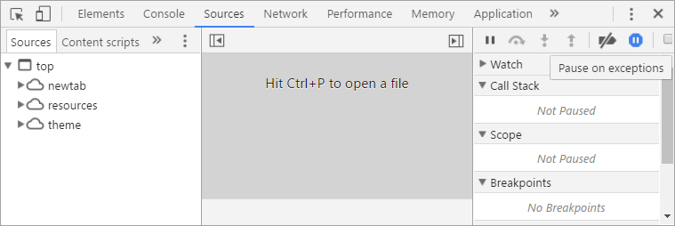

# Debugging Javascript - The Basics

When it comes to debugging a JavaScript code the first thing is to cry in despair because of the lack of proper tools. It is kind of trade-off between wild dynamic programming vs more static and type safe code. Let's explore what we can do about it and bravely fight nasty bugs!

## Debugging with `console.log`
Long, long ago, when people on Earth were using stones to do the most of their tasks, programmers were using standard output to print out information about process status. It is pretty easy to do imperatively - just add logging statements to print out values and diagnostic messages whenever there is a need.

Let's assume that that we are debugging this little function:

```javascript
function getMaxAge(people) {
  var maxAge = 10;
  for(var i=0; i<=people.length; i++) {
    var age = people[i];
    if(age <= maxAge) {
      maxAge = age;
    }
  }
  return maxAge;
}
```

When we run this with `[10, 34, 23, 50]` it returns an `undefined`. Why? Let's put some `console.log` calls to see how it is evaluated.

```javascript
function getMaxAge(people) {
  console.log('people');
  console.log(people);

  var maxAge = 10;
  for(var i=0; i<=people.length; i++) {
    console.log('processing index');
    console.log(i);

    var age = people[i];

    console.log('current age');
    console.log(age)

    console.log('testing age <= maxAge');
    console.log(age <= maxAge)

    if(age <= maxAge) {
      maxAge = age;

      console.log('found new maxAge');
      console.log(maxAge)
    }
  }
  return maxAge;
}
```

Running the same code shows clearly that something is wrong with age comparison - it should be opposite. However, after fixing that issue, still we get an `undefined` result.

That is because in the for loop the index gets out of the array's bounds [0, people.length - 1]. The for's condition should be less-than, not less-than-or-equals. Thats a very common issue, just remember:

> Don't use classic `for` loops - they are very prone to [off-by-one errors](https://en.wikipedia.org/wiki/Off-by-one_error)!

After fixing the code we can remove all the `console.log` calls.

### Printing argument names

The `console.log` iterface uses kind of string formatting, like the one used commonly in C programs. We can leaverage this to print variable name along with it's value:

```javascript
console.log('current age: %d', age)
```

However, instead of relying on old an error prone string formatting you can switch to string iterpolation introduced in ES6:

```javascript
console.log(`current age: ${age}`)
```

This brings another issue on the spotlight, instead of displaying proper object, the console just prints `[object Object]`, and that sucks. `JSON.stringify` would fix that but there is another solution - just let the console print the value and print the variable name in another call.

In order to easily debug variables and values we can use string interpolation or pass object to as an argument:

```javascript
const logValues => (obj) =>
  Object.entries(obj)
  .forEach(keyValuePair => {
    console.log(keyValuePair[0])
    console.log(keyValuePair[1])
  })
```

Then just use `logValues({variable})`, leaveraging [object property shorthand]() syntax.

todo: mention [nameof] operator from C#

## (Wire)tapping method chains

Sometimes issues occur somewhere between long chain of operations. There comes handy `tap` method inspited by [Ruby's tap](https://ruby-doc.org/core-2.4.1/Object.html#method-i-tap). Basically it  calls user defined function with the argument and returns the same argument. It is is the identity function with a side-effect callback.

```javascript
const tap = f => x => {
  f(x)
  return x
}
```

By using partial application we can then define `log` function:

```javascript
const log = tap(console.log)
```

With the help of this little method we can just insert it to a long chain of opperations and ispect the values as they flow through.

```javascript
[1, 2, 3, 4, 5]
.map(x => x * x)
.map(log)
.filter(even)
.map(log)
```

After extending Array's prototype we can use this function as a method.

```javascript
Array.prototype.tap = tap;

[1, 2, 3, 4, 5]
.map(x => x * x)
.tap(x => console.log(`squares ${x}`))
.filter(even)
.tap(even => logValues({even}))
```

There are already made modules which implement similar interface:

  * [lodash tap](https://lodash.com/docs/4.17.4#tap)
  * [underscore tap](http://underscorejs.org/#tap)
  * [bluebird tap](http://bluebirdjs.com/docs/api/tap.html)

## Debugging with DevTools

Most browsers come with built-in support of development tools. For example, you can open Chrome DevTools by pressing F12 - where you can inspect the html elements, styling, and most importantly the source code.

Whenever you are bombarded with a strange "Uncaught TypeError: undefined is not a function", or another exception you can enable *Pause on exceptions* and ispect the error in place.



This option is very handy but can be hard to use when the origin of the exception is deep in library code. However, we can use stack trace in order to diagnose the source of the issue.

### Setting breakpoints with the `debugger`

This is likely preferred basic debug tool as it allows you to inspect local variables, stack trace and doesn't involve logging to the console every time. Whenever the runtime steps on the `debugger` it will pause execution.

```javascript
const example = (data = [1, 2, 3]) => {
  const s1 = someOperation()
  debugger
  const s2 = someOperationNext()
  const total = s1 + s2
}
```

### Placing breakpoints in the sources view

By placing breakpoints with the DevTools you are free of code modifications and can debug ad-hoc issues. However, without proper source mapping the code you will likely see in the sources panel won't reasemble the original code. In order to fix that you must enable source mapping and turn it on in order to debug transpiled and minified code.

I will show you how in the following article, along with more information about how to debug node.js applications, handle transpiled code and setting your editor to allow seamless debugging. Stay tuned!
